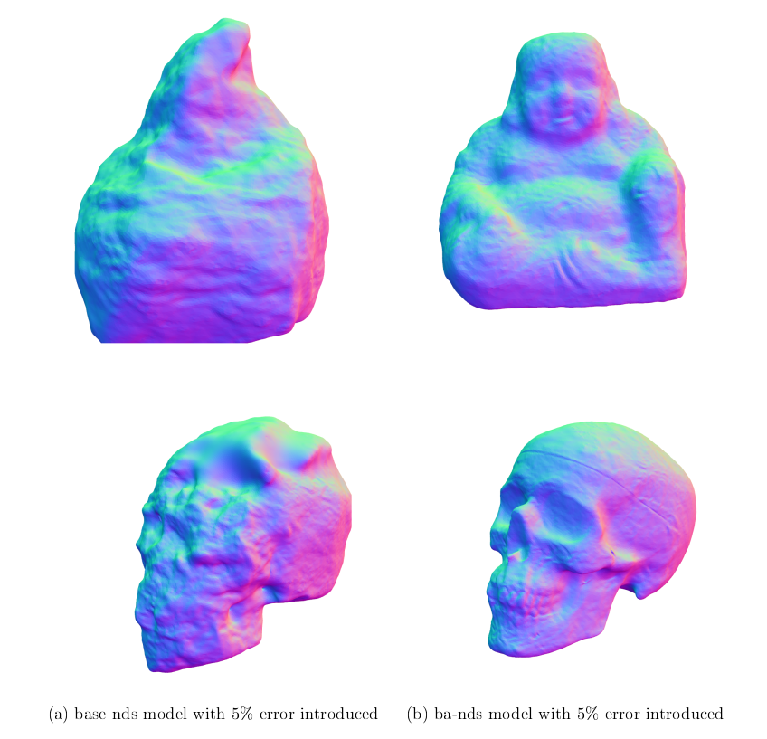

# Bundle-adjusting Deferred Shading

## Based on original [ NDS paper](https://mworchel.github.io/assets/papers/neural_deferred_shading_with_supp.pdf) 



Code to evaluate the viability of modification of original NDS approach for higher robustness using simultaneous bundle adjustment and multi-view reconstruction

## Installation

the project uses python3.10 and poetry for dependency management

### Install Poetry
Installation instructions can be found [here](https://python-poetry.org/docs/)

### Install dependencies
create a virtual environment for the project

```bash
python3.10 -m venv venv
source venv/bin/activate
poetry install --no-root
```

###  Install Cuda 12.1
The project builds several of pytorch extensions (inherited from base model) 
and, unfortunately, requires full standalone release of CUDA to do that.
The relevant version of toolkit can be found [here](https://developer.nvidia.com/cuda-12-1-0-download-archive). 
Alongside it the up-to-date Nvidia drivers need to be installed (`>525`).


## Running experiments
experiment setup uses combination of DVC (for reproducible pipeline) and Hydra integration with dvc for storing changing parameters.
current running configuration is saved in `exp_run_multiple.py`, which uses hydra's parameter substitution syntax to redeclare parts of configuration file on the fly.
running `python3 exp_run_multiple.py` will set the parameters of the model for the current experiment and use dvc to reproduce the pipeline
(download and prepare datasets for running the experiments).

### important settings
 - `params.train_pose` - parameter that switches from model from base nds mode of operation to bundle-adjusting one
 - `params.view_sampler.views_per_iter` - amount of images evaluated before each optimizer step
 - `run.upsample_iterations` - steps at which the mesh resolution is upscaled twofold
 - `run.rebuild_iterations` - only relevant for bundle-adjusting mode, sets steps at which the mesh is rebuilt for better model stability
 - `run.image_scale` - downscaling of image for VRAM-limited machines
 - `run.perturbs` - setting error values for camera extrinsics to evaluate algorithm robustness
